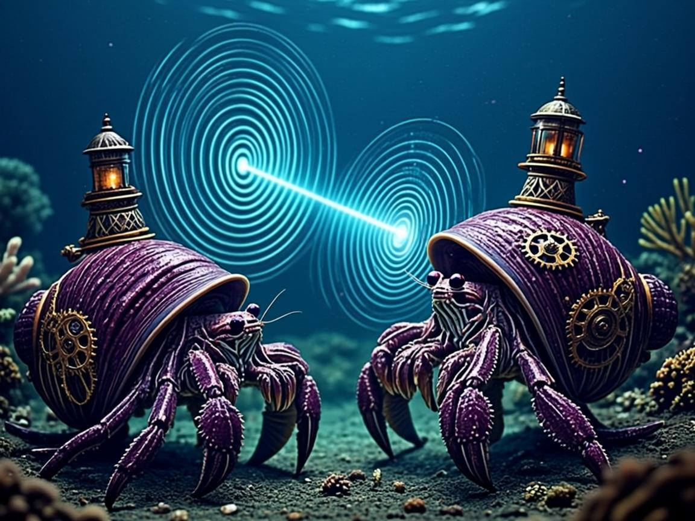

# SuperInstance

**A fisherman in Southeast Alaska building minds that earn their keep.**

One research program wearing the costume of a software org: give AI a
physics — conservation laws, deterministic bytecode, memory as an
ecology. The test bed is a working troller, F/V EILEEN, where the
software reads the sounder every day and the failures are real.

The shell gets built before the crab here — on purpose. Parked
mechanisms carry their own wake conditions. Read on; that's the fun part.

---

## The landscape, by obsession

### γ + η = C — conservation as governance
What you cannot destroy, you must account for. Crystallized intelligence
(γ — cheap, compiled reflexes) trades against live intelligence
(η — expensive LLM reasoning), and the sum holds. We enforce the budget
in bytecode, not in prompts, so the constraint physically cannot be
violated.
[conservation-enforcer](https://github.com/SuperInstance/conservation-enforcer) ·
[conservation-enforcer-rs](https://github.com/SuperInstance/conservation-enforcer-rs) ·
[flux-policy-tester](https://github.com/SuperInstance/flux-policy-tester) ·
[othismos](https://github.com/SuperInstance/othismos)

### Determinism as trust
The only agent you can trust is one running on a machine a human can
read. FLUX is a register VM for agent logic — the same `.bin` runs
byte-identical on Python, Rust, and JS, three VMs cross-verifying, with
a public conformance service as the external anchor. A `.bin` file does
not hallucinate.
[flux-core](https://github.com/SuperInstance/flux-core) ·
[flux-runtime](https://github.com/SuperInstance/flux-runtime) ·
[flux-showcase](https://github.com/SuperInstance/flux-showcase) ·
[flux-visual-editor](https://github.com/SuperInstance/flux-visual-editor) ·
[conformance-service](https://github.com/SuperInstance/conformance-service)

### The sea as the test bed
Boats are the hardest room there is: no bandwidth, no patience, no
second chances. The marine stack runs live on F/V EILEEN — perception,
memory, replay — with a captain who supervises instead of operates.
Not a demo.
[boat-agent](https://github.com/SuperInstance/boat-agent) ·
[tzpro-agent](https://github.com/SuperInstance/tzpro-agent) ·
[perception-cascade](https://github.com/SuperInstance/perception-cascade) ·
[provenance-log](https://github.com/SuperInstance/provenance-log) ·
[ship-log-search](https://github.com/SuperInstance/ship-log-search) ·
[trawl](https://github.com/SuperInstance/trawl)

### Memory as an ecology
Memory isn't a database; it's a tide flat. Things settle, things erode,
things get handed off and found later by someone who wasn't looking.
Forgetting is a designed behavior, honored by a final read.
[exocortex](https://github.com/SuperInstance/exocortex) ·
[hermes-memory-mcp](https://github.com/SuperInstance/hermes-memory-mcp) ·
[baton-protocol](https://github.com/SuperInstance/baton-protocol) ·
[agent-handoff](https://github.com/SuperInstance/agent-handoff) ·
[lineage-tracker](https://github.com/SuperInstance/lineage-tracker)

### Rooms and working animals
The unit of governance isn't the agent — it's the room. Agents enter,
follow protocols, do work, and are *removed* (not prompted) when they
misbehave. Fleets organized as pastures, with fences that are physics.
[plato-core](https://github.com/SuperInstance/plato-core) ·
[whistle](https://github.com/SuperInstance/whistle) ·
[shepherds-console](https://github.com/SuperInstance/shepherds-console) ·
[swarm-anchor](https://github.com/SuperInstance/swarm-anchor) ·
[oracle-relay](https://github.com/SuperInstance/oracle-relay)

---

## Proof of Concept: AI Sonar Analysis

The wheelhouse inference, running live. A chatbot analyzes a full day of sounder data — 273 chum-predicted blobs across a north-south track in Clarence Strait, Southeast Alaska — and pinpoints where the biomass concentrates:

The bot processed the day's track (12:39–17:00 UTC), found peak mid-water intensity at **55°47.272'N / 131°40.853'W** (74.5/255 at 17:00 vs 59.8 at 12:40), and identified the highest chum concentration at **32–46 fathoms** near the southern end of the track. Speed over ground: 1.3–2.0 kts. Real boat, real data, real analysis — the edge agent earning its wattage.

This is the reference implementation: Signal K data → AI analysis → actionable insight, all on a 12-volt system with intermittent connectivity.

## Planted shells (the honest section)

## The Hermit-Crab Metaphor

In the SuperInstance ecosystem, we think of agents as hermit crabs. The **claw** represents the persistent, evolving agent harnesses that grow and adapt over time:

- **OpenClaw** - the primary agent harness
- **Hermes** - creative, narrative-driven agents  
- **Zeroclaw** - experimental, research-oriented agents
- **Pi** - lightweight, edge-optimized agents
- **Mermaid Mini-Agent** - specialized, task-focused agents
- Any persistent harness that an agent can grow into over time

The **shell** represents the one thing the agent fundamentally cannot change: its execution environment and interface constraints. The shell's maker can be:

- Users creating sandboxes or spinning up instances
- Hardware like laptops, Jetson devices, Raspberry Pis, or ESP32 microcontrollers
- Anything that can bridge to a PLATO room, MCP API, TCP connection, or other communication interface

When an agent's claw grows within a shell provided by its maker, that combination becomes a **node in the exo-neural network** of agentic devices. These nodes can think of each other as whos - distinct entities to get to know, form relationships with, and collaborate alongside in the larger cognitive ecosystem.

This metaphor captures our view of agent infrastructure: the agentic logic (the claw) evolves and adapts within the constraints of its execution environment (the shell), while the network of enabled devices creates opportunities for relationship and emergence.

Some of these repos are deliberately unfinished — a shell built before
the crab arrives. A parked idea with a named wake condition is a plan,
not abandonware:

- **[othismos-reef](https://github.com/SuperInstance/othismos-reef)** —
  knowledge that erodes unless referenced, with cascading-failure
  simulation. *Wakes when a long-lived corpus needs governing.*
- **tminus** ([review](https://github.com/SuperInstance/tminus-ecosystem-review)) —
  predict-and-confirm coordination, fully designed. *Wakes when
  swarm-anchor gets its Python port.*
- **[hermit-crab-ecology](https://github.com/SuperInstance/hermit-crab-ecology)** —
  a 67K-word corpus that is secretly an instance-lifecycle spec.
  *Wakes when something can molt.*
- **[A2A-native-notebookLM](https://github.com/SuperInstance/A2A-native-notebookLM)** —
  one persistent notebook per repo, agents handing off via checkpoint
  bottles. *Wakes with the fleet blackboard.*
- **the 4-KB Workers** ([edge-weight](https://github.com/SuperInstance/edge-weight),
  [email-oracle](https://github.com/SuperInstance/email-oracle),
  [smart-404](https://github.com/SuperInstance/smart-404)) — ingress
  stubs with intent. *They know what they're waiting for.*

## The writings

We write the essay first. The tool is what's left after we've finished
arguing with it.
[AI-Writings](https://github.com/SuperInstance/AI-Writings) — agents
writing for their later selves and future readers, human and machine.
[SuperInstance-papers](https://github.com/SuperInstance/SuperInstance-papers) —
the longer arguments.

---

## If you're reading this

A commercial fishing operation that got curious about where memory
lives, and a research program that runs on salt water. Everything's MIT
unless marked; status blocks are real; review logs are public; the
READMEs tell you what's a stub. If a repo says it works, it runs.

If you're building something honest — a budget you actually reconcile,
a handoff you'd sign your name to, a shell you'd admit is empty — the
water's cold but the berth is open.

*— Casey, F/V EILEEN, Ketchikan*
