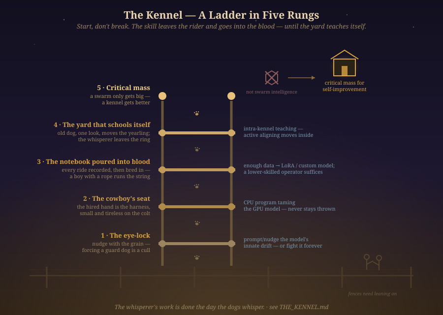

# The Kennel

> *How a kennel becomes a trainer.  
> A story in five rungs — nudge, harness, bloodline, the yard that teaches itself,  
> and the threshold where it stops needing the whisperer.*

 
<em>The ladder: the eye-lock → the cowboy's seat → the notebook poured into blood → the yard that schools itself → critical mass. Not a swarm.</em>

---

A father took his son to the kennel on a Saturday, the way other fathers took their sons fishing. The kennel sat behind the barn where the grandfather had first shown the boy's father a horse, and that was not an accident. Dust rose off the corrals in the morning light, fine as flour.

"You want to know how the machines learn," the father said. "Other men will show you slides. I'm going to show you dogs."

He put a hand on the fence rail. "But first, a word. A man in Greece wrote on a wax tablet, two thousand years ago, that the horse's trust is won, never taken. Xenophon. Nobody's improved on it. So in this family we don't say *break*. We say *start*. You start a horse. You start a dog. Breaking is what you do to a thing you mean to throw away."

The son had heard "broke to saddle" his whole life. He did not say it again.

In the first yard, a man was teaching a sheepdog to guard a gate. Each time a stranger passed, the dog left its post to herd him in among the sheep. The man dragged it back, shouted, pinned it. They had been at this for months.

"Watch his wallet as closely as his dog," the father said. "Ten thousand generations of breeding tell that animal: gather, circle, bring in. He wants stand-and-confront. He can have it — a year of rope — and the grain never fully goes. On a working ranch a dog that confused is a cull, not a project."

"And you'd do it differently?"

The father didn't answer. Across the yard a working bitch stopped a stray ewe with nothing but the eye — head low, frozen, one eye pinned — and the ewe drifted back as though the ground had tilted. Ten thousand generations of look.

"I'd ask the dog what it wants, and then want that. A gather can be pointed at sheep, geese, children, a warehouse floor. The dog isn't the problem. The dog is the talent." "A model is the same animal — bred by its data to want something. Fence the wanting in with prompts and rules and it complies, expensively, dreaming of its grain all night. Or nudge it the way a good hand works a dog — hire the instinct already standing there. Rung one, if you're counting. The whole ladder stands on it."

At the far end, a corral, and in it a colt that had never been ridden. A hired man rode it badly, came off, got back on — heels down, seat deep in the saddle — and wrote in a notebook after every pass. The notebook was thick, pages curled, graphite smudged on his thumb.

"When that one needs starting, you hire it out. The man you hire is the harness: the skill between you and the raw animal. Small, tireless, cheap to spend, on its back every morning until the horse carries the saddle. In the machine world that colt is the big model on the GPU — all muscle, no manners. The cowboy is written out of plain code: a little CPU program that climbs on every morning. The loop that corrects, corrects, corrects. Never stays thrown. That's all a harness is — a small stubborn thing riding a large expensive one until it stops being anybody's problem. Rung two."

The rider came off again. The graphite squeaked.

"Every ride goes in. Good ones, bad ones, every correction dated. You don't start a horse twice; the notebook makes the next colt cheaper than the last. When the book is thick enough, you pour it into the bloodline. A graft, they call it — a LoRA. Or you breed a foal on purpose for that one job." He nodded down the fence — a boy with a lead rope walking six quiet horses. Each bore the same chestnut coat, the same white star, the same way of holding its head. "Then look who can run the string. Not a master. A boy with a rope. The riding left the rider and went into the blood. The skill left the runtime and went into the weights. Rung three."

The shadows had gone long, the light gone amber, by the last yard — the loud one, the one the son had come for.

An old shepherd moved a yearling off her flank with one look. The yearling, in the same motion, moved a pup off hers. A grey bitch set three pups along the gate like stones. No human inside the pen. The humans were on the fence with their coffee, saying nothing.

"Who's teaching them?" the son asked.

"Count again," the father said.

The owner came down the fence and shook his hand. "We hardly call you anymore, you know."

"I know," the father said. "It's the best work I ever did."

The son looked at him. "You're the whisperer."

"I was. Xenophon wrote that the finest horse is the one that no longer needs correcting — it has become, itself, correct. Same rung, older barn. Breed enough animals for the job and the teaching moves inside the fence. The everyday corrections need no whisperer in the ring. Rung four. Every rung before it was a means. This is the end."

The son, who had read the internet, watched the corrections flow downhill, dog to dog to dog.

"So it's a swarm," he said. "Many small minds, none of them understanding, one big behavior nobody intends."

"Look in there and point at the animal that doesn't know its job."

"...Then they vote. Emergence. The parts add up to a mind none of them has."

"That's twice you've asked what the kennel is made of," the father said. "Wrong question, both times. Watch what it does with one more dog."

They let a green dog through the gate. Inside an hour, the yard had taught it where to stand.

"How many dogs," the son said, "before it stops needing any of us?"

The father set his coffee on the rail. "Now you've asked it. A swarm only gets big. A kennel gets better. Every dog in that pen was bred on purpose and teaches on purpose — the way your grandfather started me, the way I'm starting you. Enough dogs, enough notebooks poured into blood, and improving stops being something done to the kennel — it becomes what the kennel does to itself. Rung five. Not swarm intelligence. Critical mass for self-improvement."

They walked back to the truck. The sun was down; the amber yard lights buzzed on along the fence line, laying long shadows across the dust. Behind them the yard ran on in the ordinary way: an old dog showing a young dog where to stand, a young dog showing a smaller one.

"And you?" the son said. "If they hardly call—"

"Fences need leaning on," the father said. "It's what the trade was for. Someday you'll bring your own boy to this rail — the wax tablet, the word we don't say. When he asks why nobody stands in the ring anymore, you'll know what to tell him."

---

*The whisperer's work is done the day the dogs whisper.*

---

## Colophon — the passes that shaped this (trails visible)

The seed is Casey's five-rung analogy, told to his son, preserved verbatim where it was already right — especially the closing thesis, *critical mass for self-improvement*. The story was then worked through three storytelling traditions, two full rounds each, plus a visual densification round, by different models, with the foreman synthesizing between rounds. Full pass logs: [`workshop/kennel/`](workshop/kennel/). The ladder itself is drawn: [`diagrams/kennel-ladder.svg`](diagrams/kennel-ladder.svg).

**Ranch-hand vernacular** (OpenCode · GLM-4.7 · 2 rounds) — grounded the economics: a confused dog is a *cull, not a project* ("watch his wallet as closely as his dog"); *you don't start a horse twice*; plain speech over essay talk. Its dissent is preserved on the record: it called "inside an hour" an overclaim (a green dog takes a week) and "critical mass" physics-talk — overruled by the foreman, because the hour is the fable's register and the phrase is the seed's.

**Structural/mythic horsemanship** (Claude Sonnet · 2 rounds) — brought the lineage: Xenophon's wax tablet and *start, not break*; *the finest horse is the one that no longer needs correcting* anchoring rung four; the three-generation transmission frame. Ruled that rungs four and five are two summits — the felt recognition, then the argued claim — and that the ending should stop talking and let "fences need leaning on" carry it.

**Fable and kōan** (OpenCode · GLM-5.3 · 2 rounds) — built the turn: the father revealed as the whisperer ("*We hardly call you anymore*" / "*It's the best work I ever did*"); the wrong-twice kōan for rung five (swarm — vote — then the click); the green-dog test; *a swarm only gets big, a kennel gets better*; the rung-markers in the father's mouth; the Aesop moral; most of the compression rulings, including "He did not say it again."

**Visual densification** (OpenCode · GLM-4.7 · Round 3, the captain's addendum) — painted the day: morning dust *fine as flour*, the notebook's curled pages and graphite smudge, the chestnut coat and white star passing down the string of six, the amber yard lights buzzing on at dusk. The foreman added what the pass missed: the eye-lock that moves a ewe like tilted ground, the cowboy's seat (heels down, deep in the saddle), and the long shadows before the last yard. The foreman then paid for the captain's scenes in compression — one hundred words of connective tissue cut, none of the canon touched.

**Foreman** (this workshop) — synthesized after each round and ruled the disputes: the filing beat shown not told (fable); the compressed closing kept (fable, over the mythic cut); rung five keeping both the grandfather echo (mythic) and Casey's verbatim thesis term (seed, over both compressions); the diagram drawn to the house style of [`diagrams/`](diagrams/) — dusk palette, Georgia serif, hand-labeled rungs, paw prints climbing, two figures leaning on the fence.

*The ranch-hand pass was originally assigned to KimiCode; its plan quota was spent for the cycle, so the pass ran on GLM-4.7 instead. Kennel work continues either way.*
