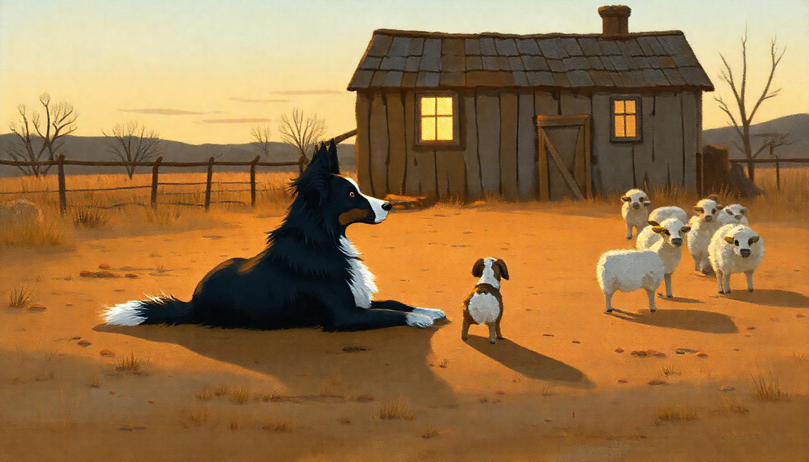

# The Kennel, Vol. II — A Day of Matching

The boy from the fence rail came back a father, and what he brought on his shoulders was a girl, six years old and loud about it.

"Grandpa said the dogs teach themselves," she said.

"They do," her father said. "Somebody had to teach the teaching."

At the ranch house the whisperer was waiting — a woman the old man had started, his last student. She had a day of work to show them, because riders were coming.

---

The jockey came through the gate first: small, light, in a hurry the way water is in a hurry. He wanted fast.

"You want quick," the whisperer said. "Fast is a road horse; quick is a cow horse. Fast gets longer; quick gets shorter." She gave him the little mare that stops and turns like a thought, and the small dog that reads a rider's knee before the rider knows he's asked. "Short rides, short words. That's your hand's touch."

The packer came at noon with a string of mules packed high, a man who thought in miles and days. She gave him the wide calm horses and the big steady dogs that can walk beside a mule from dark to dark without once losing their temper.

"Why not the fast ones?" the girl asked.

"Some jobs want a race," her father said. "Some want a string of mules."

"Slow knots, checked twice," the whisperer told the packer. "Your touch is patience. His job isn't to be first. His job is to arrive — all of him, every load."

Last came a kid on a fat patient pony, holding the rope all wrong and having a wonderful time. The whisperer matched him to the gentlest dog in the yard, one that had seen every mistake a child can make and thought none of them were news. The pony stood like a hill.

"Somebody paid for that patience," her father said. "In the breeding."

---

In the tack room the notebook man from the colt years was waiting, his thumb still graphite-smudged. He took one stirrup off the wall — wide, flared, heavy — and hung it in front of the girl.

"A knight's stirrup. Built so a man in iron could put his whole weight behind a lance." He waved down the barn. "The knights are four hundred years gone. Look at every saddle in here. The shape of an old war rides with you."

"Why keep it?" the girl asked.

"Because it kept somebody alive."

"Is the war over?"

The old man hung the stirrup back on its nail. "You're never sure."

Her father touched the iron once, lightly. "It's the same in my world. A system prompt is somebody's old lance. Kept because it held. You don't file the shape off until you're sure — and you're never sure. So it rides."

The old man stood the way he always stood, weight forward on the balls of his feet, like a man still bracing something. In the doorway, the whisperer stood the exact same way.

---

The flock came after lunch, and the girl asked her question at the rail.

"Which one's the boss sheep? Her — the big one in front."

"Watch her," her father said.

The big ewe stopped to eat. The flock flowed around her like water around a stone and went on being a flock.

"Then the dogs give the orders," the girl said.

"Watch the sheep obey."

She watched. The dogs gave no orders. The dogs leaned on the world, and the sheep moved off the leaning, the way grass moves off wind. Pressure, moving like weather.

"No boss," the girl said slowly. "Only weather."

She watched the lead dog take the whistle from the whisperer's hand, and the young dogs take their line off the lead dog.

"Outside the sheep, a harness," she said. "Inside, weather. The dogs wear the harness standing in the weather."

"The bridge," her father said. "You send dogs."

She was quiet for a while, turning it. "Machine side?" she asked, trying the words on.

"Machine side," he said.

After that, he said less and less.

---

Late in the day the pup went out — first season, turned loose, and the whistle stayed hanging on its post. The pup gathered the small band clean, set them at the gate, and lay down.

Nobody clapped. The whisperer was studying a horse's feet. Her father was cinching a saddle.

Only the old grey bitch had watched the whole thing, from the fence shadow. Now she stopped watching. Turned away. Found the last patch of sun.

"Nobody told her good dog," the girl said.

"No one ever will again," the whisperer said.

The girl looked at the pup a long time. It was just a dog lying at a gate. Whatever it was wearing now, she couldn't see it.

---

On the way back, one young dog cut another at the water trough — a shoulder check, a growl pitched exactly right. Nobody saw it but the girl.

She told the whisperer.

The whisperer smiled like a person being paid. "That's the wage now. The kennel pays itself."

---

At dusk the whisperer oiled her boots, whistled up her one old dog, and walked down the road past the rail — past it, without leaning on it.

The girl ran after her. "Are you done? Is the kennel finished?"

"No," said the whisperer. "Finished is for museums."

"Then why are you leaving?"

"Because it doesn't whisper to me anymore."

"To who, then?"

The whisperer pointed back at the yard, where the yard lights were buzzing on: an old dog showing a young dog where to stand, and the young dog showing a smaller one.

"To itself."

She went down the road, weight forward on the balls of her feet, bracing something no one else could see. The dark took her and her dog the ordinary way it takes everybody.

The girl went back and stood at the rail, where her father had stood when he was the one learning. She listened. Chains. A bark. Somebody's bucket. Dogs shifting in the dust. The kennel went on saying whatever it was saying, and it was not saying it to her.

She decided she could wait.

---

*Nothing is finished. Some things just stop speaking to you.*

---

## Colophon — the passes that shaped this (trails visible)

The seed is Casey's Vol. II spine (rider types; the vestigial stirrup; harness vs the flock; the invisible harness; dogs teaching dogs; the ending — it whispers to itself), worked as a day at the ranch. The story went through three storytelling traditions, two full rounds, by different models, with the foreman synthesizing between rounds and ruling disputes. Full pass logs: [`workshop/kennel-vol2/`](workshop/kennel-vol2/). Volume I lives at [`THE_KENNEL.md`](THE_KENNEL.md); the day is drawn: [`diagrams/kennel-day-vol2.svg`](diagrams/kennel-day-vol2.svg) (companion to Vol. I's [`diagrams/kennel-ladder.svg`](diagrams/kennel-ladder.svg)).

**Ranch-hand vernacular** (GLM-4.7 via OpenCode · 2 rounds — the pass was originally assigned to KimiCode; its plan quota is spent for the cycle, so it ran on GLM again, as in Vol. I) — kept the economics honest: *fast is a road horse, quick is a cow horse*; mules *packed high*, not rigged; *somebody paid for that patience, in the breeding*; *the kennel pays itself*. Round 2's de-towning sweep is all through the final: *slow knots*, *steady dogs*, *turned loose* (never "off-leash" — dog-park talk), *yard lights* (nobody at dusk ever said "amber"), *just* for *merely* in the moral.

**Structural/mythic horsemanship** (Claude Sonnet · 2 rounds) — the stirrup beat as the day's fulcrum, with Lynn White underneath: a small iron shape that reorganized a society and outlived its war by centuries. Its major gift is the planted tell: the old man's forward-weight stance, shared silently by the whisperer — she is the last stirrup, an old shape carried into new tack, and the ending walks her forward without ever naming the comparison. Ruled the summit count: pup's wordless graduation (competence), the trough correction (autonomy), the exit (succession) — three peaks, each quieter than the last. Confirmed the ending rhymes with Vol. I without restating it: Vol I said the work is done when the dogs whisper; Vol. II is the day it happened, from inside the teacher's boots.

**Fable and kōan** (GLM-5.3 via OpenCode · 2 rounds) — built the spine the final follows most closely. Its rulings: the boss-sheep question gets the wrong-twice kōan (wrong at *the big one in front*, wrong again at *the dogs give the orders*, click at *no boss, only weather*); the invisible harness must go almost unnoted — the adults study a horse's feet, and "No one ever will again" is all the graduation gets; machine-world lines cut from five to two, the only survivors being the stirrup's *old lance* and the girl's own *"Machine side?"*; the ending defeated without translation (*the dark took her the ordinary way it takes everybody*); and the harder moral: *Nothing is finished. Some things just stop speaking to you.*

**Foreman** (this workshop) — synthesized after each round and ruled the round-2 disputes. From the fable's cut of the packer's double speech, the foreman kept the whisperer's *"His job is to arrive"* and cut the father's freight line instead — one minting per coin, but the coin kept is the whisperer's. From the fable's deletion of the father's bridge lecture, the foreman kept three words — *"You send dogs"* — as the seed's gem, and let the rest of the silence stand. Where the mythic and fable passes both voted for silence over commentary (the stirrup's *"the shape is still riding"*, the *"nobody had ever told her why"*, the ending's *"a shape she had never been taught"*), the foreman took their silence. The diagram follows the house style of [`diagrams/`](diagrams/): dawn-to-dusk gradient left to right, Georgia serif, hand-drawn stations for the day's six beats, and the whisperer walking off-frame weight-forward while the kennel's whisper-arcs curl back into itself.

*The ranch-hand pass notes, for the record, that the moral's only remaining word in a suit is "nothing." It was allowed to stay.*
