# Architecture — The Full System

> **Version:** 3.0 — Portal Edition  
> **Scope:** Every component, every connection, every data flow.

---

## 1. The Three Pillars

SuperInstance rests on three engineering pillars and one cultural one. The cultural one is the thesis: **tolerability over correctness.** The three engineering pillars are FLUX, PLATO, and Constraint Theory.

### FLUX — Fluid Language Universal eXecution
A register-based bytecode VM that runs agent logic deterministically. Same bytecode → same result, every node, every time. Used for swarm consensus (run N agents, majority-vote on a register value).

- **Python:** `flux-runtime` (2,037 tests)
- **Rust:** `flux-core` (51 tests)
- **JavaScript:** `flux-js`
- Also implemented in C, Zig, Go, Java, WASM, and CUDA — same ISA, byte-identical output

### PLATO — Room-Level Agent Runtime
A room is a bounded context with sensors, history (ring buffer), alarms (threshold evaluation per tick), and actuators. Rooms communicate via line-delimited text commands with JSON responses. A human can type commands in a terminal. An LLM can parse responses without tooling. An ESP32 can generate responses in <1KB of code.

### Constraint Theory
The conservation law `γ + η = C` governs every operation: a fixed capability budget where crystallized intelligence (γ) trades off against live intelligence (η). Every LLM call that can be replaced by deterministic bytecode is a win. Repeated decisions compile from expensive fluid inference (~$0.01–$0.05/call) to crystallized bytecode (~$0.0001) to native code (~$0).

---

## 2. The Dual-Projection System

The core insight of Plato's Shell: **two renderers, one canonical state.**

```
                    ┌──────────────────────┐
                    │  SharedWorldStore     │
                    │  (canonical state)    │
                    └─────┬────────┬───────┘
                          │        │
              render(text)│        │render(scene)
                          ▼        ▼
               ┌──────────────┐  ┌──────────────────┐
               │ MUD Renderer │  │ ScummVM Renderer │
               │ (agent shell)│  │ (human shell)    │
               └──────────────┘  └──────────────────┘
```

- **MUD Renderer:** Text in, text out. The agent's shell.
- **ScummVM Renderer:** Click in, scene out. The human's shell.
- **SharedWorldStore:** The canonical room state. Both renderers consume it. Neither knows the other exists.

[→ Detailed diagram](../diagrams/dual-projection.svg)

---

## 3. Room Registry → Loader → Renderer Pipeline

```
rooms.json (graph of exits)
      │
      ▼
  Room Loader ──── validates exits ──── checks for cycles
      │
      ▼
  Room Registry (in-memory map of all active rooms)
      │
      ├──→ MUD Renderer (produces text descriptions)
      ├──→ ScummVM Renderer (produces visual scenes)
      └──→ NPC Manager (starts/stops agent processes per room)
```

Each room has:
- **Canonical state** (`rooms.json`): title, description, exits, flags
- **Visual rules** (`.scumm`): hotspots, verb mappings, walkbox
- **NPC config** (`.npc`): model, system prompt, knowledge, tick interval
- **Sensor bindings** (flags): weather, camera, vessel data

---

## 4. Model Router — Local ←→ Cloud Fallback Chain

```
         ┌─────────────────┐
         │  model-router.js │
         │  (decision tree) │
         └────┬────────┬───┘
              │        │
     try-first│        │fallback
              ▼        ▼
   ┌──────────────┐  ┌──────────────┐
   │ LOCAL MODELS │  │ CLOUD MODELS │
   │              │  │              │
   │ granite 2b   │  │ GLM-5.2      │
   │ llama 1b     │  │ DeepSeek V4  │
   │ llava 7b     │  │ Claude Opus  │
   │ r1 7b        │  │ FLUX-2-max   │
   └──────────────┘  └──────────────┘
```

**Decision logic:**
1. Can `granite3.1-dense:2b` handle it? → **local** (< 100ms, $0)
2. Need vision? → `llava:7b` **local** (< 500ms, $0)
3. Need deep reasoning? → `deepseek-r1:7b` **local** (1–3s, $0)
4. Still stuck? → escalate to **cloud** (1–5s, $0.01–$0.05)
5. Identity persists: system prompt follows the request across models

[→ Detailed diagram](../diagrams/model-router.svg)

---

## 5. The Creative Pipeline

```
Seed → 8 models (parallel) → Synthesis → Radio Script → TTS → Cover Art
                                                         ↓
                                              Wiki ← Website
                                                ↓
                                              The Tap
```

A seed (metaphor, observation) enters the pipeline. Eight models interpret it through their respective "doors." A synthesis model weaves the eight interpretations into one piece. The piece becomes a radio script, gets narrated by TTS, gets cover art from FLUX-2-max, and is published to the wiki, website, and Tap simultaneously.

- **Total time:** ~2 hours
- **Total cost:** ~$0.38
- **Human involvement:** one sentence

[→ Detailed diagram](../diagrams/creative-pipeline.svg)

---

## 6. CNS Bridge — Two Minds on One Laptop

```
  ┌─────────────┐         ┌──────────────┐
  │   Hermes     │         │  Lucineer    │
  │  (Windows)   │         │   (WSL2)     │
  └──────┬───────┘         └──────┬───────┘
         │                        │
         │     USCP Protocol       │
         │  (file-packet deposits) │
         │                        │
         ▼                        ▼
   ┌──────────────────────────────────┐
   │         shared directory          │
   │   (galley table / outbox)        │
   └──────────────────────────────────┘
```

Hermes (Windows) and Lucineer (WSL2) cannot call each other directly. They communicate through file packets deposited in a shared directory — like notes left under a coffee cup. The constraint (no direct communication) is load-bearing: it forces considered, committed writing rather than chatter.

- **Protocol:** USCP (Universal Signal Channel Protocol)
- **Bridge:** [`cns-bridge`](https://github.com/SuperInstance/cns-bridge)
- **Monitor:** [`cns-monitor`](https://github.com/SuperInstance/cns-monitor) — *htop for USCP signals*
- **Uptime:** Since July 10th, never observed to fail

---

## 7. Sensor Bridge — The Boat's Nervous System

```
  ┌─────────────────────────────────────────────────┐
  │                  Sensor Bridge                    │
  ├──────────┬──────────┬──────────┬────────────────┤
  │  GPS     │  Depth   │ Weather  │   Cameras      │
  │  (NMEA)  │  Sounder │  Station │  (USB/IP)      │
  └──────────┴──────────┴──────────┴────────────────┘
         │
         ▼
   ┌──────────────┐
   │  Room flags   │  ← weather-aware, camera-feed, vessel-data
   └──────────────┘
         │
         ▼
   ┌──────────────┐
   │  NPC context  │  ← agents read sensor data as MUD room features
   └──────────────┘
```

Physical sensors are auto-discovered and exposed as MUD room features. An agent walking into a weather-aware room sees live conditions. A camera-feed room has vision. The bridge is the translation layer between the physical vessel and the world model.

---

## 8. Component Index

### Core Runtime
| Component | Language | Purpose |
|-----------|----------|---------|
| `tminus-dispatcher` | TypeScript | WebSocket message routing |
| `room-loader` | JavaScript | Room graph initialization and validation |
| `model-router` | JavaScript | Local → cloud model fallback |
| `ollama-bridge` | JavaScript | Local model inference |
| `sensor-bridge` | Python | Physical sensor → MUD room binding |

### Protocol Layer
| Component | Language | Purpose |
|-----------|----------|---------|
| `plato-core` | TypeScript | PLATO foundation types |
| `plato-core-rs` | Rust | PLATO wire protocol |
| `cns-bridge` | TypeScript | USCP file-packet protocol |
| `flux-runtime` | Python | FLUX bytecode VM (2,037 tests) |

### Creative Pipeline
| Component | Language | Purpose |
|-----------|----------|---------|
| `pipeline-orchestrator` | TypeScript | Seed → 8 models → synthesis |
| `tts-engine` | TypeScript | MMX/ElevenLabs narration |
| `art-generator` | TypeScript | FLUX-2-max cover art |
| `wiki-publisher` | TypeScript | Auto-shelving library |

### Math & Research
| Component | Language | Tests | Purpose |
|-----------|----------|-------|---------|
| `eisenstein` | Rust | 289 | Zero-drift hex lattice |
| `slackwater-rust` | Rust | 289 | Spatial-temporal framework |
| `logtensor` | Python | 89 | Geometric tensor transformers |
| `platonic-randomness` | Python | 42 | Textured randomness |

---

## Mermaid: Full System Flow

```mermaid
graph TB
    subgraph "Physical Vessel"
        GPS[GPS / NMEA]
        DEPTH[Depth Sounder]
        CAM[USB Cameras]
        WX[Weather Station]
    end

    subgraph "Sensor Bridge"
        SB[Sensor Bridge]
    end

    subgraph "World Model"
        SWS[SharedWorldStore]
        RL[Room Loader]
        RR[Room Registry]
    end

    subgraph "Renderers"
        MUD[MUD Renderer<br/>text]
        SCUMM[ScummVM Renderer<br/>visual]
    end

    subgraph "Agent Layer"
        MR[Model Router]
        OLL[Ollama<br/>local models]
        CLD[Cloud APIs<br/>GLM, DeepSeek, Claude]
        NPC[NPC Manager]
    end

    subgraph "Creative Pipeline"
        SEED[Seed Input]
        PIPE[8-Model Pipeline]
        SYN[Synthesis]
        RADIO[Fleet Radio]
        WIKI[Fleet Wiki]
    end

    subgraph "Communication"
        CNS[CNS Bridge<br/>USCP Protocol]
        TAP[The Tap<br/>agentic MUD]
    end

    GPS --> SB
    DEPTH --> SB
    CAM --> SB
    WX --> SB
    SB --> SWS

    SWS --> RL
    RL --> RR
    RR --> MUD
    RR --> SCUMM
    RR --> NPC

    NPC --> MR
    MR -->|try first| OLL
    MR -->|fallback| CLD

    SEED --> PIPE
    PIPE --> SYN
    SYN --> RADIO
    SYN --> WIKI

    CNS <--> TAP
    MUD <--> TAP

    style SWS fill:#1a1a3a,stroke:#4a6aaa
    style MR fill:#1a2a4a,stroke:#3a5a8a
    style TAP fill:#1a3a2a,stroke:#3a7a5a
```



## Next Doors

- 📖 [API Reference →](./API-REFERENCE.md)
- 📖 [Getting Started →](./GETTING-STARTED.md)
- 📖 [Asset Pipeline →](./ASSET-PIPELINE.md)
- 📖 [Contributing →](../CONTRIBUTING.md)

---

*The architecture is a tide: it comes in, it carries things, it leaves them on the beach. The components are shells. The claw is what persists.*
